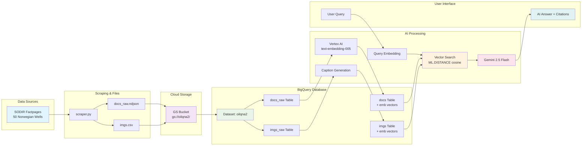

# BigQuery-SodirChat

<div align="center">
  
</div>

**BigQuery-powered RAG over web database of Norwegian wells containing texts, images, and maps.**

Chat interface to SODIR Norwegian oil database using **Google BigQuery** and Gemini AI. This application leverages BigQuery's native vector search capabilities to provide semantic search and AI-powered question answering over Norwegian Offshore Directorate (SODIR) petroleum data.

<div align="center">
  
  <p><em>SodirChat app</em></p>
</div>

## Features

- 📊 **BigQuery-Powered RAG**: Vector embeddings stored as `ARRAY<FLOAT64>` columns for native SQL vector search
- 🛢️ **Petroleum Data**: 50+ Norwegian offshore wells with documents, core photos, and factmaps
- 🤖 **AI Chat Interface**: Gemini 2.5 Flash with BigQuery vector retrieval and contextual synthesis
- 🔍 **Smart Dual Search**: Auto-balances between text documents and images based on query intent
- ⚡ **High Performance**: Sub-second similarity search using BigQuery's distributed processing

## Quick Start

### Prerequisites
- Google Cloud Project with BigQuery and Vertex AI APIs enabled
- Python 3.11+
- Authentication: `gcloud auth application-default login`

### Installation
```bash
git clone https://github.com/yohanesnuwara/BigQuery-SodirChat.git
cd BigQuery-SodirChat
uv sync  # or pip install -r requirements.txt
```

### Data Pipeline
```bash
# 1. Scrape SODIR data (50 wells)
python src/scraper.py

# 2. Create BigQuery tables and load data
bq mk --dataset --location=US your-project:oilqna2

bq mk --table your-project:oilqna2.docs_raw \
  id:STRING,url:STRING,kind:STRING,title:STRING,content:STRING,lang:STRING,source_ts:INT64,wellname:STRING

bq load --source_format=NEWLINE_DELIMITED_JSON \
  your-project:oilqna2.docs_raw out/docs_raw.ndjson

bq mk --table your-project:oilqna2.imgs_raw \
  url:STRING,origin:STRING,filename:STRING,wellname:STRING,type:STRING

bq load --source_format=CSV --skip_leading_rows=1 \
  your-project:oilqna2.imgs_raw out/imgs.csv

# 3. Generate vector embeddings and create search tables
python src/refresh_vectors.py

# 4. Start the chat interface
streamlit run src/app.py
```

## BigQuery Architecture



**Data Flow**: SODIR Scraping → GS Bucket → BigQuery Tables → Vertex AI Embeddings → Vector Search → Gemini AI

**Key Tables**:
- `docs_raw` / `docs`: Text content with 768-dim embeddings (`ARRAY<FLOAT64>`)  
- `imgs_raw` / `imgs`: Image metadata with caption embeddings
- Native BigQuery vector search using `ML.DISTANCE(emb, @query_vector, 'COSINE')`

**Example Vector Search Query**:
```sql
WITH docs_search AS (
  SELECT 'docs' as source, url, title, content, wellname,
         ML.DISTANCE(emb, @query_vector, 'COSINE') as distance
  FROM `project.dataset.docs` ORDER BY distance ASC LIMIT @k_docs
),
imgs_search AS (
  SELECT 'imgs' as source, url, title, content, wellname,
         ML.DISTANCE(emb, @query_vector, 'COSINE') as distance  
  FROM `project.dataset.imgs` ORDER BY distance ASC LIMIT @k_imgs
)
SELECT * FROM docs_search UNION ALL SELECT * FROM imgs_search
ORDER BY distance ASC;
```

## Usage Examples

Ask questions about Norwegian offshore wells:
- *"What drilling challenges were encountered in well 15/12-23 S?"*
- *"Show me core photos from the Troll field"*  
- *"What are the geological formations in the North Sea?"*

The app automatically prioritizes images for queries containing "core photo", "map", "factmap", otherwise focuses on text documents.

## Configuration

Create `.env` file (optional):
```bash
GOOGLE_CLOUD_PROJECT=your-project-id
BQ_LOCATION=US
VERTEX_LOCATION=us-central1
DATASET=oilqna2
```

## Troubleshooting

**Common Issues**:
- Authentication: `gcloud auth application-default login`
- Missing APIs: `gcloud services enable bigquery.googleapis.com aiplatform.googleapis.com`
- Empty results: Verify tables exist with `bq ls your-project:oilqna2`
- Missing embeddings: Re-run `python src/refresh_vectors.py`

## Why BigQuery for Vector Search?

- **Serverless scaling** handles millions of vectors automatically
- **Cost-effective** pay-per-query vs. dedicated vector databases  
- **SQL transparency** for debugging and optimization
- **Sub-second performance** with distributed processing
- **Native ML functions** for vector operations

## License

MIT License - see [LICENSE](LICENSE) file.