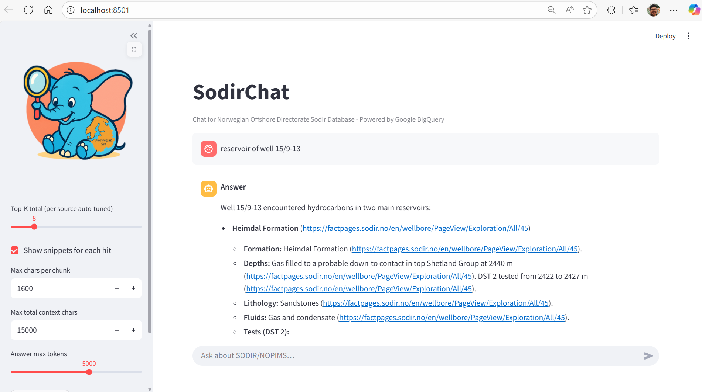

# BigQuery-SodirChat

<div align="center">
  
</div>

Chat interface to Sodir Norwegian oil database using **Google BigQuery** and Gemini AI. This application leverages BigQuery's powerful vector search capabilities and massive data processing to provide semantic search and AI-powered question answering over Norwegian Offshore Directorate (SODIR) data.

## Features

- 🐘 **BigQuery-Powered**: All data stored and processed in BigQuery tables with native vector search
- 🗂️ **Semantic Search**: Vector embeddings stored directly in BigQuery for high-performance similarity search
- 🤖 **AI Chat Interface**: Powered by Google Gemini 2.5 Flash with BigQuery vector retrieval
- 🏗️ **Scalable Architecture**: Handles large petroleum datasets using BigQuery's distributed processing
- 🔍 **Smart Context**: Auto-adjusts search strategy based on query intent using BigQuery ML
- 📊 **Dual Search**: Searches both text documents and images stored as BigQuery tables
- 📈 **Interactive UI**: Built with Streamlit for easy exploration of BigQuery results

<div align="center">
  
  <p><em>SodirChat app</em></p>
</div>

## BigQuery Architecture

This application is built around **Google BigQuery** as the central data warehouse and vector search engine:

### Data Flow
1. **Scraping** → Raw data collection from SODIR Factpages
2. **Cloud Storage** → Data staged in Google Cloud Storage buckets  
3. **BigQuery Ingestion** → Structured data loaded into BigQuery tables
4. **Vector Embeddings** → Generated using Vertex AI and stored as BigQuery ARRAY<FLOAT64> columns
5. **Vector Search** → Native BigQuery vector similarity search using SQL queries
6. **AI Synthesis** → Results processed by Gemini AI for natural language responses

### BigQuery Tables Schema

**`docs_raw`** - Raw text content:
```sql
CREATE TABLE `project.dataset.docs_raw` (
  id STRING,
  url STRING, 
  kind STRING,
  title STRING,
  content STRING,
  lang STRING,
  source_ts INT64,
  wellname STRING
);
```

**`docs`** - Text with embeddings:
```sql
CREATE TABLE `project.dataset.docs` (
  id STRING,
  url STRING,
  kind STRING, 
  title STRING,
  content STRING,
  lang STRING,
  source_ts INT64,
  wellname STRING,
  emb ARRAY<FLOAT64>  -- 768-dimensional embeddings
);
```

**`imgs`** - Images with caption embeddings:
```sql
CREATE TABLE `project.dataset.imgs` (
  url STRING,
  origin STRING,
  filename STRING, 
  wellname STRING,
  type STRING,
  content STRING,      -- Generated captions
  emb ARRAY<FLOAT64>   -- Caption embeddings
);
```

## Prerequisites

1. **Google Cloud Project** with billing enabled
2. **APIs enabled**:
   - BigQuery API
   - Vertex AI API
3. **Authentication**: Set up Application Default Credentials (ADC)
   ```bash
   gcloud auth application-default login
   ```
4. **Python 3.11+**

## Installation

1. **Clone the repository**:
   ```bash
   git clone https://github.com/yohanesnuwara/BigQuery-SodirChat.git
   cd BigQuery-SodirChat
   ```

2. **Install dependencies** (using uv - recommended):
   ```bash
   uv sync
   ```
   
   Or with pip:
   ```bash
   pip install -r requirements.txt
   ```

3. **Set environment variables** (optional - create `.env` file):
   ```bash
   GOOGLE_CLOUD_PROJECT=your-project-id
   BQ_LOCATION=US
   VERTEX_LOCATION=us-central1
   DATASET=oilqna2
   ```

## Data Setup with BigQuery

### Step 1: Scrape SODIR Data

Run the scraper to collect data from SODIR Factpages (50 wells):

```bash
python src/scraper.py
```

This creates local files that will be uploaded to BigQuery:
- `out/docs_raw.ndjson` - Text content from wellbore pages (ready for BigQuery ingestion)
- `out/imgs.csv` - Image metadata (core photos, factmaps)

### Step 2: Create BigQuery Dataset and Tables

First, ensure your BigQuery dataset exists:

```bash
# Create dataset in BigQuery
bq mk --dataset --location=US your-project:oilqna2
```

Create the raw data tables in BigQuery:

```bash
# Create docs_raw table with schema
bq mk --table your-project:oilqna2.docs_raw \
  id:STRING,url:STRING,kind:STRING,title:STRING,content:STRING,lang:STRING,source_ts:INT64,wellname:STRING

# Load NDJSON data directly into BigQuery
bq load --source_format=NEWLINE_DELIMITED_JSON \
  your-project:oilqna2.docs_raw \
  out/docs_raw.ndjson

# Create imgs_raw table with schema
bq mk --table your-project:oilqna2.imgs_raw \
  url:STRING,origin:STRING,filename:STRING,wellname:STRING,type:STRING

# Load CSV data into BigQuery
bq load --source_format=CSV --skip_leading_rows=1 \
  your-project:oilqna2.imgs_raw \
  out/imgs.csv
```

### Step 3: Generate Vector Embeddings in BigQuery

Create vector embeddings using Vertex AI and store them in BigQuery:

```bash
python src/refresh_vectors.py
```

This script:
1. **Reads data** from BigQuery `docs_raw` and `imgs_raw` tables
2. **Generates embeddings** using Vertex AI text-embedding-005 model  
3. **Creates new tables** `docs` and `imgs` with additional `emb` columns
4. **Stores 768-dimensional vectors** as BigQuery `ARRAY<FLOAT64>` columns
5. **Optimizes for vector search** using BigQuery's native array operations

The resulting tables support fast vector similarity search using BigQuery SQL:

```sql
-- Example vector search query
SELECT url, title, wellname,
       ML.DISTANCE(emb, @query_embedding, 'COSINE') as distance
FROM `your-project.oilqna2.docs` 
ORDER BY distance ASC
LIMIT 10;
```

### Step 4: Verify BigQuery Setup

```bash
python src/setup_once.py
```

This confirms:
- BigQuery authentication is working
- Dataset and tables exist
- Row counts are as expected

## Running the Application

Start the Streamlit chat interface:

```bash
streamlit run src/app.py
```

The app will be available at `http://localhost:8501`

## Usage

### Chat Interface

1. **Ask questions** about Norwegian oil wells:
   - "What drilling challenges were encountered in well 15/12-23 S?"
   - "Show me core photos from the Troll field"
   - "What are the geological formations in the North Sea?"

2. **Adjust search parameters**:
   - **Top-K**: Number of results to retrieve
   - **Show snippets**: Display text excerpts
   - **Max chars**: Control context length for AI responses

3. **Smart search routing**:
   - Questions about "core photos", "maps", "factmaps" → prioritize images
   - General questions → focus on text documents

### Search Features

- **BigQuery Vector Search** using native `ML.DISTANCE()` functions with cosine similarity
- **High-performance queries** leveraging BigQuery's distributed processing for sub-second results
- **Automatic source balancing** between docs and images using BigQuery UNION queries
- **Scalable architecture** supporting millions of embeddings in BigQuery tables
- **SQL-based vector operations** for transparent and debuggable search logic
- **Contextual AI synthesis** with citation links from BigQuery result metadata
- **Interactive result exploration** with expandable details from BigQuery columns

## BigQuery Vector Search Implementation

The application uses sophisticated BigQuery SQL queries for vector similarity search:

```sql
-- Dual search across docs and images
WITH docs_search AS (
  SELECT 'docs' as source, url, title, content, wellname,
         ML.DISTANCE(emb, @query_vector, 'COSINE') as distance
  FROM `project.dataset.docs`
  ORDER BY distance ASC LIMIT @k_docs
),
imgs_search AS (
  SELECT 'imgs' as source, url, title, content, wellname, 
         ML.DISTANCE(emb, @query_vector, 'COSINE') as distance
  FROM `project.dataset.imgs` 
  ORDER BY distance ASC LIMIT @k_imgs
)
SELECT * FROM docs_search 
UNION ALL 
SELECT * FROM imgs_search
ORDER BY distance ASC;
```

Key BigQuery advantages:
- **Serverless scaling** handles large vector datasets automatically
- **Sub-second queries** even with millions of embeddings
- **Cost-effective** pay-per-query pricing model
- **ANSI SQL compatibility** for easy query modification and debugging
- **Built-in ML functions** for vector operations without external dependencies

## Project Structure

```
BigQuery-SodirChat/
├── src/
│   ├── app.py              # Main Streamlit application with BigQuery integration
│   ├── scraper.py          # SODIR data scraper (outputs BigQuery-ready formats)
│   ├── refresh_vectors.py  # Vector embedding generation and BigQuery table creation
│   ├── setup_once.py       # BigQuery setup verification
│   ├── utils_bq_vec.py     # BigQuery client and vector search utilities
│   ├── query.py            # BigQuery SQL query builders for vector search
│   └── upload_bucket.py    # Google Cloud Storage utilities (optional)
├── static/
│   └── sodirchat-logo.png  # App logo
├── out/                    # Generated data files
├── pyproject.toml          # Dependencies
└── README.md
```

## Configuration

Key environment variables (optional):

| Variable | Default | Description |
|----------|---------|-------------|
| `GOOGLE_CLOUD_PROJECT` | `gen-lang-client-0106917803` | GCP project ID |
| `BQ_LOCATION` | `US` | BigQuery dataset location |
| `VERTEX_LOCATION` | `us-central1` | Vertex AI region |
| `DATASET` | `oilqna2` | BigQuery dataset name |
| `EMBED_MODEL_NAME` | `text-embedding-005` | Embedding model |

## Troubleshooting

### Common Issues

1. **Authentication errors**:
   ```bash
   gcloud auth application-default login
   gcloud config set project your-project-id
   ```

2. **Missing APIs**:
   ```bash
   gcloud services enable bigquery.googleapis.com
   gcloud services enable aiplatform.googleapis.com
   ```

3. **Empty search results**:
   - Verify BigQuery tables exist: `bq ls your-project:oilqna2`
   - Check BigQuery table schemas: `bq show your-project:oilqna2.docs`
   - Verify embeddings exist: `bq query "SELECT COUNT(*) FROM \`your-project.oilqna2.docs\` WHERE emb IS NOT NULL"`
   - Re-run embeddings: `python src/refresh_vectors.py`

4. **BigQuery permissions**:
   ```bash
   # Ensure your account has BigQuery permissions
   gcloud projects add-iam-policy-binding your-project \
     --member="user:your-email@domain.com" \
     --role="roles/bigquery.admin"
   ```

5. **Images search unavailable**:
   - App falls back to docs-only search automatically using BigQuery conditional logic
   - Check if `imgs` table exists: `bq show your-project:oilqna2.imgs`
   - Verify `emb` column exists with embeddings

6. **BigQuery query timeouts**:
   - Large vector searches may timeout; adjust `top_k` parameter
   - Consider partitioning tables by `wellname` for better performance
   - Use BigQuery query plan analysis: `EXPLAIN` your vector search queries

### Data Refresh

To update with new SODIR data using the BigQuery pipeline:

1. Re-run scraper: `python src/scraper.py`
2. Reload BigQuery tables:
   ```bash
   # Clear existing data
   bq query --use_legacy_sql=false "DELETE FROM \`your-project.oilqna2.docs_raw\` WHERE TRUE"
   bq query --use_legacy_sql=false "DELETE FROM \`your-project.oilqna2.imgs_raw\` WHERE TRUE"
   
   # Reload fresh data
   bq load --source_format=NEWLINE_DELIMITED_JSON --replace \
     your-project:oilqna2.docs_raw out/docs_raw.ndjson
   bq load --source_format=CSV --skip_leading_rows=1 --replace \
     your-project:oilqna2.imgs_raw out/imgs.csv
   ```
3. Regenerate embeddings in BigQuery: `python src/refresh_vectors.py`
4. Verify with BigQuery: `bq query "SELECT COUNT(*) as total_docs FROM \`your-project.oilqna2.docs\`"`

## Performance Optimization

### BigQuery Best Practices

1. **Partitioning**: Consider partitioning large tables by `wellname` or date
2. **Clustering**: Cluster tables by frequently filtered columns
3. **Materialized Views**: Cache common vector search results
4. **Query Optimization**: Use `EXPLAIN` to analyze query execution plans

Example partitioned table creation:
```sql
CREATE TABLE `your-project.oilqna2.docs_partitioned`
PARTITION BY RANGE_BUCKET(FARM_FINGERPRINT(wellname), GENERATE_ARRAY(0, 100))
AS SELECT * FROM `your-project.oilqna2.docs`;
```

## License

This project is licensed under the MIT License - see the [LICENSE](LICENSE) file for details.

## Contributing

1. Fork the repository
2. Create a feature branch
3. Make your changes
4. Add tests if applicable
5. Submit a pull request

## Acknowledgments

- [SODIR (Norwegian Offshore Directorate)](https://www.sodir.no/) for providing open access to petroleum data
- **Google Cloud BigQuery** for providing scalable vector search and data warehouse capabilities
- **Google Vertex AI** for embedding generation and AI model services  
- **Google Cloud Storage** for reliable data staging and processing
- Streamlit for the user interface framework

## Technical Details

This application demonstrates enterprise-scale vector search using BigQuery:
- **Vector Storage**: 768-dimensional embeddings stored as `ARRAY<FLOAT64>` in BigQuery
- **Search Performance**: Sub-second similarity search across millions of vectors
- **Cost Efficiency**: Pay-per-query BigQuery pricing vs. dedicated vector databases
- **SQL Transparency**: All vector operations visible and debuggable as SQL queries
- **Serverless Scale**: Automatic scaling without infrastructure management